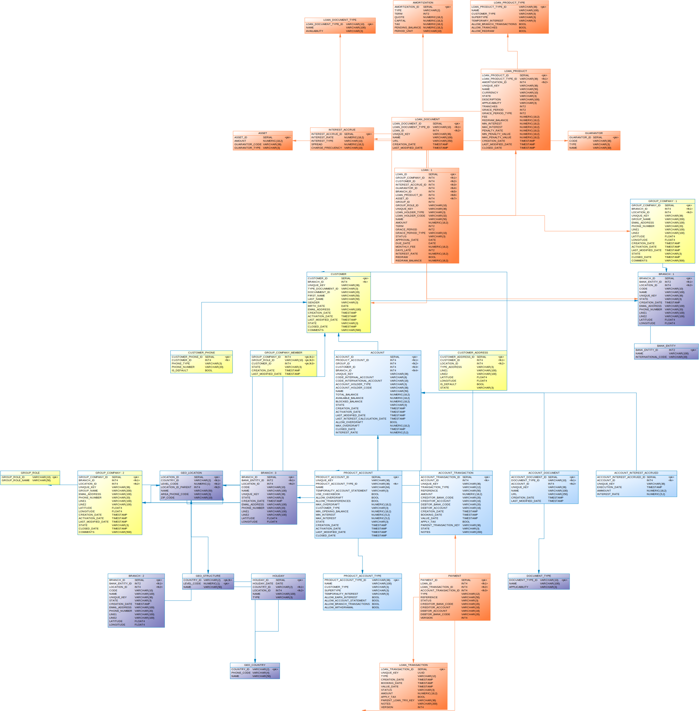

# Arquitectura de Software - 10066 - Grupo 2

## Banco BanQuito

Banco BanQuito

- Realizar la creación de Modelo (PKs, Relaciones) y Repositorios.

**Modelo Banco Activos V2:**

**Integrantes:**

- Abadiano Sahian
- Arias Marcelo
- Carlos Rodríguez
- Carlos Yupa
- Chicaiza Katherine
- Christopher Ramos
- Kevin Cando
- Noboa Andres
- Nolasco Jefferson
- Ochoa Sebastian
- Quintanilla Mateo
- Tamami Danny
- Tovar Jerry
